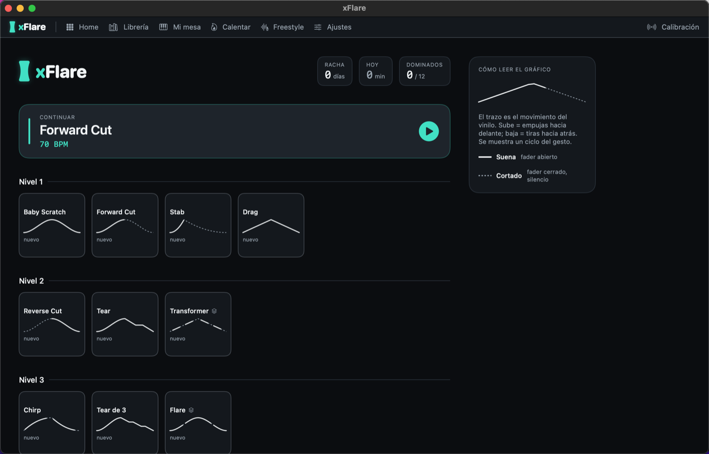
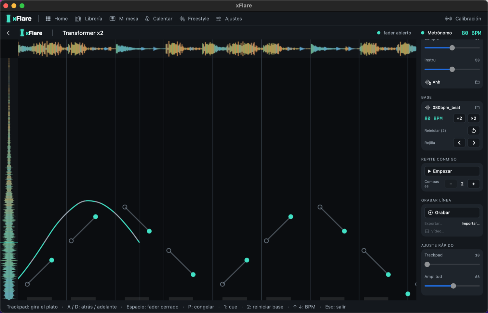
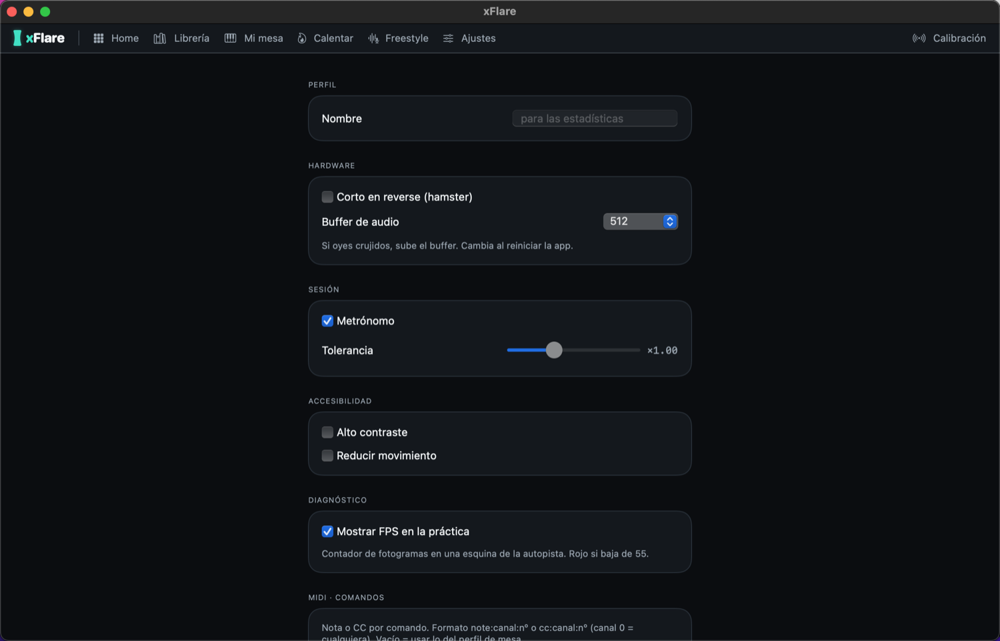
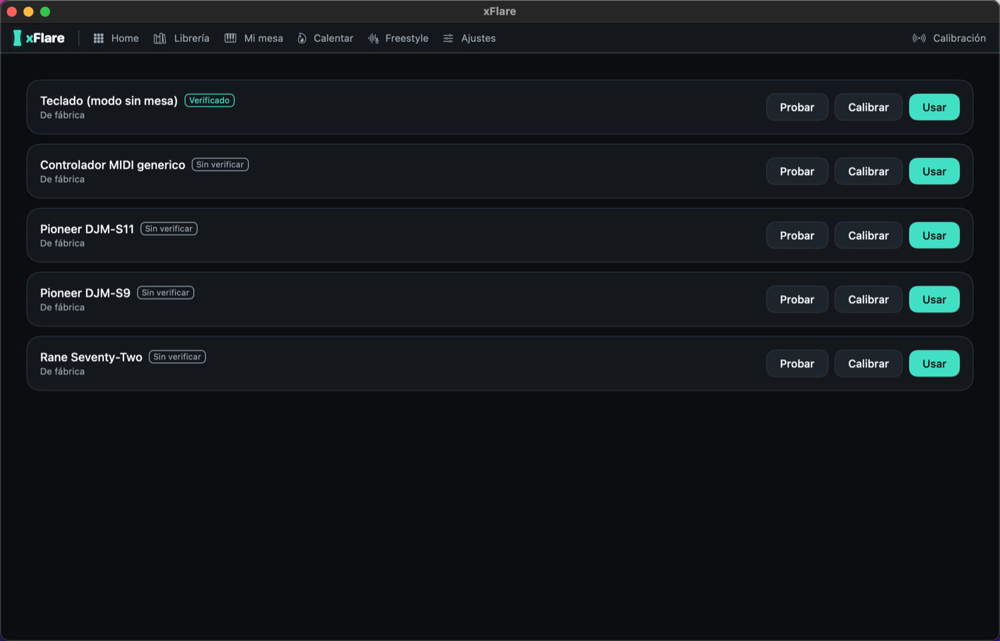

# xFlare

Entrenador de scratch y turntablism para macOS. "Synthesia para scratch": conectas
tu mesa y tus platos con timecode, la app te muestra el patron objetivo y te dice
exactamente donde falla tu mano y tu fader.

- **Plataforma:** macOS **11.0 Big Sur o superior**. Binario **universal**
  (Intel `x86_64` + Apple Silicon `arm64`). Linux/Windows fuera del alcance v1.
- **Apple Silicon:** compilado nativo y **logica verificada en CI**. El audio en
  tiempo real y el timecode **aun no se han probado en hardware Apple Silicon**.
  Si tienes un Mac M y una mesa, tu informe vale oro. Ver `docs/ARCHITECTURES.md`.
- **Toolchain fijada:** Xcode 14.2 / Swift 5.7.2 (techo de macOS Monterey).
  Leer `docs/PLATFORM_SUPPORT.md` antes de tocar codigo.
- **Hardware de referencia:** Rane Seventy-Two (MK1) + platos con vinilo timecode.
- **Stack:** Swift (SwiftUI + SpriteKit + CoreMIDI + GRDB) ~80%, C/C++17 ~20%
  (callback CoreAudio en tiempo real + `timecoder.c` de xwax vendorizado).
- **Techo de latencia:** tabla por máquina (ADR-024): ≤ 10 ms round-trip en la
  máquina de referencia, ≤ 15 ms aceptable en el Intel de 2015. Es puerta de
  calidad del bloque B1 / B4. Ver `docs/PLATFORM_SUPPORT.md` §7.

## Estado

**Preview jugable sin mesa.** Ya funciona: navegacion completa, **Trucos** (matriz
de scratches en tarjetas con su grafico TTM), practica en vivo con audio (scratch
por trackpad/teclado + base instrumental + metronomo), Freestyle, grabar una
linea y exportarla a `.xfsession` o a **video** (con audio, con la proporcion de
la ventana), calentamiento adaptativo, "Mi mesa" (perfiles), **Libreria** de
medios (instrumentales pre-analizadas que cargan al instante + 4 slots de sample
asignables a botones MIDI), Ajustes con reasignacion de comandos por MIDI. El
render de la autopista va a **60 fps estables** en el MacBook Pro Intel de 2015
(medido).

**Falta para la v1:** la puerta de latencia de audio y el timecode reales — todo
lo que necesita la Rane 72 delante (bloques B1/B4/B5/B6/B8 de `TODO.md`). Sin
mesa, la practica va con raton/teclado.

### Probarlo

```bash
swift run xFlare            # desde el repo, con toolchain de dev
# o un .app / .dmg:
make app                    # xFlare.app (debug, con sonido si tienes Audio/)
make dmg REL=1              # xFlare-<version>.dmg (release universal, SIN samples)
```

El DMG no esta notarizado: al abrirlo la primera vez, **clic derecho sobre la app
> Abrir > Abrir**. El release universal no incluye samples de audio (con
copyright, `CLAUDE.md` §12); carga los tuyos desde Ajustes / "Cargar sample…".

## Capturas

| | |
|---|---|
| **Home** — la matriz de trucos con su grafico TTM (lleno = suena, a rayas = cortado) y la leyenda |  |
| **Practica** — la autopista con la rejilla de compas, la onda de la instrumental arriba y el rail del sample a la izquierda |  |
| **Ajustes** — buffer de audio, tolerancia, diagnostico de FPS y reasignacion de comandos por MIDI. Todo local |  |
| **Mi mesa** — perfiles `.conf` por modelo, con insignia de verificado y prueba en vivo |  |

## Documentacion

| Fichero | Que contiene |
|---|---|
| `CLAUDE.md` | Instrucciones permanentes para Claude Code. Leer primero. |
| `PLAN.md` | Plan estrategico: definicion del MVP (v1), hoja de ruta de iteraciones, criterios de aceptacion y riesgos. |
| `docs/DECISIONS.md` | **Todos los ADR (001 a 058).** Decisiones de arquitectura. |
| `docs/TIMECODE.md` | Notas del decoder: xwax 1.10 vendorizado, warnings, latencia. |
| `docs/NOTATION.md` | XFN: como se representa y dibuja un scratch. |
| `docs/CURRICULUM.md` | El gym: niveles, sesiones, scoring, diagnostico. |
| `docs/MATRIX_MAPPING.md` | Relacion con la Periodic Matrix + reglas legales. |
| `docs/PACK-CONTENTS.md` | Inventario del pack de scratch y como regenerarlo. |
| `TODO.md` | **El backlog por bloques, en orden de prioridad.** Empieza aqui. |
| `docs/ARCHITECTURE.md` | Modulos, capas y protocolo de sellado. |
| `docs/UI_DESIGN.md` | Tokens de diseno y pantallas. |
| `docs/DEVICE_PROFILES.md` | Perfiles `.conf` por modelo de mesa y asistente de mapeo. |
| `docs/PRIOR_ART.md` | Visual Scratch, TTM, S-notation y donde esta el hueco. |
| `docs/PLATFORM_SUPPORT.md` | **Minimo macOS 11, Xcode 14.2, APIs prohibidas.** |
| `docs/ARCHITECTURES.md` | Intel y Apple Silicon: universal, CI arm64, Rosetta. |
| `docs/SCORING.md` | Puntos, tres estrellas, progreso e historial. |
| `docs/VARIANTS.md` | Variantes por transformacion del patron base **(en pausa: `variants.json` = solo `base`)**. |
| `docs/WARMUP.md` | Calentamiento adaptativo, editable, en una sola sesion (**F.0** cerrado). |
| `docs/TESTING.md` | Golden tests, replay de sesiones, presupuesto de latencia. |
| `docs/MODULE_STATUS.md` | Que modulos estan sellados. |
| `docs/HW_BRINGUP.md` | Runbook para el dia que se conecte la mesa + platos + vinilo. |
| `docs/RELEASE.md` | Como se corta una release (DMG sin notarizar) + plantilla de la nota. |

## Licencia

**GPL-3.0-only.** Impuesta por la vendorizacion de [xwax](https://xwax.org/)
1.10 (`timecoder.c`, `lut.c`), que es **GPL-3.0** desde su version 1.8. Ver
`docs/DECISIONS.md` ADR-003 y ADR-030.

Consecuencias que ya estan decididas y no se rediscuten:
- La Mac App Store queda descartada (sus terminos chocan con la GPL — precedente
  VLC). Distribucion: DMG notarizado + Homebrew.
- Nunca habra version closed-source. Vender si se puede; cerrar el codigo, no.
- Dependencias: MIT y BSD siempre; **Apache-2.0 tambien** (es compatible con
  GPLv3, no lo era con GPLv2). Cualquier dependencia nueva necesita ADR igualmente.

El fichero `LICENSE` contiene el texto oficial de la GNU GPL version 3.
Ver `LICENSE-TODO.md`.

## Atribuciones

- **xwax** (c) Mark Hills — decodificacion de timecode, GPL-3.0-only.
- La notacion visual de xFlare esta **inspirada** en el trabajo de TTM Academy y la
  Periodic Matrix of Skratches de DJ Raedawn. **xFlare no esta afiliado ni
  respaldado por ellos**, y no redistribuye material suyo.
